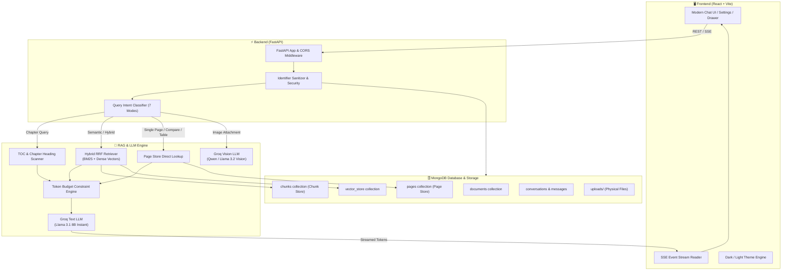

# 🤖 Personal AI — Multi-Tier Document RAG & Multimodal Assistant

> An AI Assistant featuring **Page-Aware Document RAG**, **Hybrid BM25 + Dense Vector Retrieval (Reciprocal Rank Fusion)**, **Table of Contents & Chapter-Aware Routing**, **Multimodal Image Analysis**, and **Real-Time Streaming SSE**. Built with FastAPI, LangChain, MongoDB, Groq, and React.

---

## 🛒 Commercial Availability & Gumroad License

This software is an AI platform designed for independent developers, founders, and teams looking to self-host or integrate document RAG and vision capabilities into their workflows.

- **Purchase Commercial License**: Available on Gumroad
- **What You Receive**: Complete unminified source code (FastAPI backend + React frontend), 3-tier RAG engine, verified automated test suites, setup scripts, and documentation.
- **License Terms**: Full rights to customize, self-host, and deploy for personal and commercial business infrastructure. Reselling or distributing the source code is strictly prohibited (see [LICENSE](LICENSE)).

---

## 📑 Table of Contents

- [Overview](#-overview)
- [Architecture & Data Flow](#-architecture--data-flow)
- [Key Features](#-key-features)
- [Tech Stack](#-tech-stack)
- [Getting Started](#-getting-started)
  - [Prerequisites](#prerequisites)
  - [1. Backend Setup](#1-backend-setup)
  - [2. Frontend Setup](#2-frontend-setup)
- [Environment Configuration](#-environment-configuration)
- [MongoDB Setup](#-mongodb-setup)
- [Groq API Key Setup](#-groq-api-key-setup)
- [API Reference](#-api-reference)
- [Document RAG Engine Deep-Dive](#-document-rag-engine-deep-dive)
  - [3-Tier Document Architecture](#3-tier-document-architecture)
  - [Table of Contents & Chapter Scanner](#table-of-contents--chapter-scanner)
  - [Query Intent Routing](#query-intent-routing)
  - [Token Budget & 413 Overflow Protection](#token-budget--413-overflow-protection)
- [Deployment Guide](#-deployment-guide)
- [Running Automated Verification Tests](#-running-automated-verification-tests)
- [Commercial License & Terms](#-commercial-license--terms)

---

## 🌟 Overview

**Personal AI** is an advanced AI assistant engineered for pinpoint document comprehension and high-accuracy knowledge retrieval. Personal AI uses a multi-tier document storage and retrieval architecture designed to improve page-aware retrieval, document grounding, and context efficiency:

1. **Original Storage Tier**: Preserves binary documents with checksum validation and metadata tracking.
2. **Discrete Page Store Tier**: High-speed lookup by exact document page number, extracted tables, and scanned detection.
3. **Semantic Chunk Vector Store Tier**: High-density vector embeddings paired with BM25 keyword indexing using Reciprocal Rank Fusion (RRF).

---

## 🏛 Architecture & Data Flow



---

## ✨ Key Features

- 📑 **Page-Aware Document RAG**: Page-bounded chunk indexing that preserves exact document page numbers for accurate citations.
- 📖 **Hybrid Table of Contents & Chapter Scanner**: Scans PDF outline bookmarks, in-text TOC pages, and chapter headings to identify exact titles and page ranges.
- 🎯 **Reciprocal Rank Fusion (RRF)**: Combines dense vector search (`sentence-transformers/all-MiniLM-L6-v2`) with exact BM25 keyword matching.
- ⚡ **Token Budget & Anti-Overflow Guard**: Enforces strict context bounds ($\le 2500$ tokens) and chat history trimming ($\le 800$ tokens) to keep requests safely within LLM token limits and prevent 413 Payload Too Large errors.
- 👁️ **Multimodal Vision Analysis**: Drag-and-drop or paste images (PNG, JPG, WEBP) for OCR, chart interpretation, and architectural diagrams.
- 🔄 **Self-Healing Index Reconciliation**: Cold-start auto-sync reconciles missing chunks and vectors on the fly without failing user queries.
- 🌓 **Adaptive Dark & Light Modes**: Seamless real-time theme toggling with smooth transitions and system preference detection.
- 🎙️ **Voice Recognition & Speech Input**: Hands-free voice transcription directly into the message composer.
- 🛡️ **Clean Configuration Architecture**: Safe `.env.example` templates with placeholders to protect credentials.

---

## 🛠 Tech Stack

| Layer | Technologies |
| :--- | :--- |
| **Backend Framework** | Python 3.12, FastAPI, Uvicorn, Motor (async), PyMongo |
| **RAG & AI Orchestration** | LangChain, SentenceTransformers, PyPDF, Pandas, OpenPyXL, Docx2txt |
| **LLM Provider** | Groq Cloud API (`llama-3.1-8b-instant`, `qwen/qwen3.6-27b`) |
| **Vector Search & DB** | MongoDB (Native local instance or MongoDB Atlas Vector Search) |
| **Frontend Framework** | React 18, Vite, Lucide Icons, React Markdown, React Syntax Highlighter |
| **Styling & Design** | Modern Vanilla CSS, Glassmorphism, CSS Custom Properties |

---

## 🚀 Getting Started

### Prerequisites
- **Python 3.10+** (Python 3.12 recommended)
- **Node.js 18+** & `npm`
- **MongoDB** running locally (`mongodb://localhost:27017`) or a MongoDB Atlas connection string
- A **Groq Cloud API Key** ([Get one for free at console.groq.com](https://console.groq.com/keys))

---

### 1. Backend Setup

```bash
# 1. Navigate to the backend directory
cd backend

# 2. Create and activate a Python virtual environment
python3.12 -m venv venv
source venv/bin/activate  # On Windows: .\venv\Scripts\activate

# 3. Install dependencies
pip install -r requirements.txt

# 4. Configure environment variables
cp .env.example .env
# Edit .env and paste your GROQ_API_KEY

# 5. Start the FastAPI backend server
uvicorn main:app --reload --host 127.0.0.1 --port 8000
```
> Backend API will be running at: **`http://127.0.0.1:8000`**  
> Interactive Swagger API Documentation: **`http://127.0.0.1:8000/docs`**

---

### 2. Frontend Setup

```bash
# 1. Open a new terminal and navigate to frontend directory
cd frontend

# 2. Install dependencies
npm install

# 3. Configure environment variables
cp .env.example .env

# 4. Start Vite development server
npm run dev -- --host 127.0.0.1 --port 5173
```
> Frontend Application will be accessible at: **`http://127.0.0.1:5173`**

---

## ⚙️ Environment Configuration

### Backend (`backend/.env`)

```env
# Groq Cloud API Credentials (Required)
GROQ_API_KEY=your_groq_api_key_here
GROQ_MODEL=llama-3.1-8b-instant
GROQ_VISION_MODEL=qwen/qwen3.6-27b

# RAG & Retriever Parameters
RAG_TOP_K=8

# Database Connection (MongoDB Local or Atlas)
MONGODB_URI=mongodb://localhost:27017
DB_NAME=rag_assistant

# CORS Security Allowed Origins
ALLOWED_ORIGINS=http://localhost:5173,http://127.0.0.1:5173
```

### Frontend (`frontend/.env`)

```env
# Backend API Base URL
VITE_API_BASE_URL=http://localhost:8000
```

---

## 🗄️ MongoDB Setup

### Option A: Local MongoDB (Recommended for Development)
Ensure MongoDB is running locally on port `27017`:
```bash
# macOS (Homebrew)
brew services start mongodb-community@7.0

# Linux (systemd)
sudo systemctl start mongod
```

### Option B: MongoDB Atlas (Cloud)
1. Create a free cluster at [mongodb.com/cloud/atlas](https://www.mongodb.com/cloud/atlas).
2. Copy your connection string and update `backend/.env`:
   ```env
   MONGODB_URI=mongodb+srv://<username>:<password>@cluster0.mongodb.net/?retryWrites=true&w=majority
   ```

---

## 🔑 Groq API Key Setup

1. Sign up at [console.groq.com](https://console.groq.com/).
2. Navigate to **API Keys** and generate a new key.
3. Add the key to `backend/.env`:
   ```env
   GROQ_API_KEY=your_groq_api_key_here
   ```

---

## 📖 Document RAG Engine Deep-Dive

### 1. 3-Tier Document Architecture
- **Tier 1 (Original Binary)**: Physical files saved under `uploads/` with SHA-256 integrity hashes.
- **Tier 2 (Discrete Page Store)**: Dedicated MongoDB `pages` collection where each document page is stored with metadata: `{ document_id, page_number, text, tables, is_blank, is_scanned }`.
- **Tier 3 (Chunk Vector Store)**: Chunks of `2200` characters with `220` overlap, strictly partitioned page-by-page to prevent cross-page citation pollution.

### 2. Table of Contents & Chapter Scanner
When a user asks about a chapter (e.g. *"What is Chapter 6?"*), the query router:
- Scans `doc["toc"]` (extracted from PDF bookmarks, in-text TOC lines, and chapter headings).
- Matches chapter titles deterministically and retrieves the exact page span (e.g., Pages 161–190).
- Validates extracted chapters against document structure to improve chapter-title accuracy and page-range reliability.

### 3. Token Budget Equation
To prevent Groq 413 token limit errors, the engine strictly bounds prompt tokens:
$$\text{System Prompt } (450) + \text{History } (\le 800) + \text{User Query } (50) + \text{Context } (\le 2500) + \text{Max Output } (1200) \le 5000 \text{ tokens} < 6000 \text{ token limit}$$

---

## 🧪 Running Automated Verification Tests

The backend includes a comprehensive automated test suite:

```bash
cd backend
source venv/bin/activate

# 1. Test complete RAG pipeline, chapter routing, page lookup, and token budgeting
python test_rag_pipeline_fixes.py

# 2. Test lifecycle (upload -> chunk -> index -> search -> retrieve -> cleanup)
python test_rag_lifecycle_verification.py

# 3. Test full PDF access and multi-page reasoning
python test_full_pdf_access.py
```

---

## 🚢 Deployment Guide

### Production Build (Frontend)
```bash
cd frontend
npm run build
```
Compiled static assets will be in `frontend/dist/`, ready to be served by Nginx, Cloudflare Pages, Vercel, or FastAPI static mounts.

### Production Backend (Uvicorn / Gunicorn)
```bash
cd backend
source venv/bin/activate
uvicorn main:app --host 0.0.0.0 --port 8000 --workers 4
```

---

## 📜 Commercial License & Terms

This software is distributed under a **Custom Commercial License Agreement**.
- **Copyright (c) 2026 Vivek Chowdary Dama / Personal AI Assistant. All rights reserved.**
- Buyers are granted full rights to use, customize, and deploy the application for internal and client commercial workflows.
- Public redistribution, sublicensing, reselling, or open-sourcing of the underlying source code is strictly prohibited.
- See the full legal agreement in [LICENSE](LICENSE).
